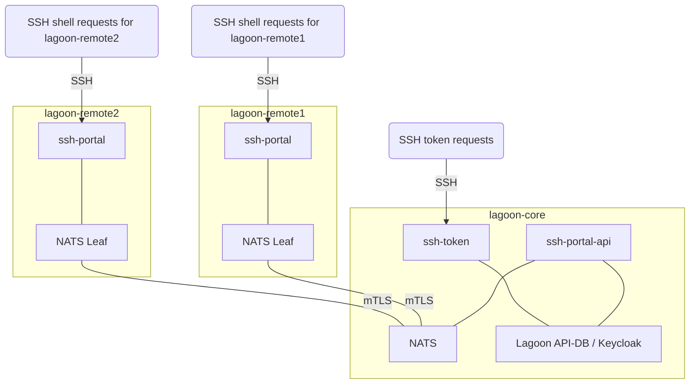
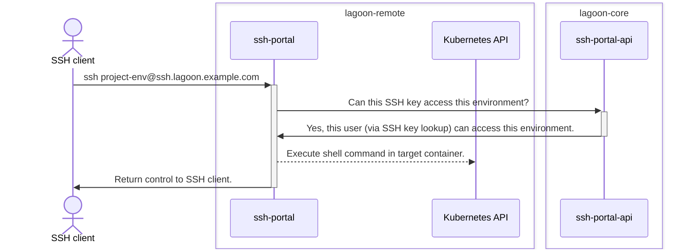
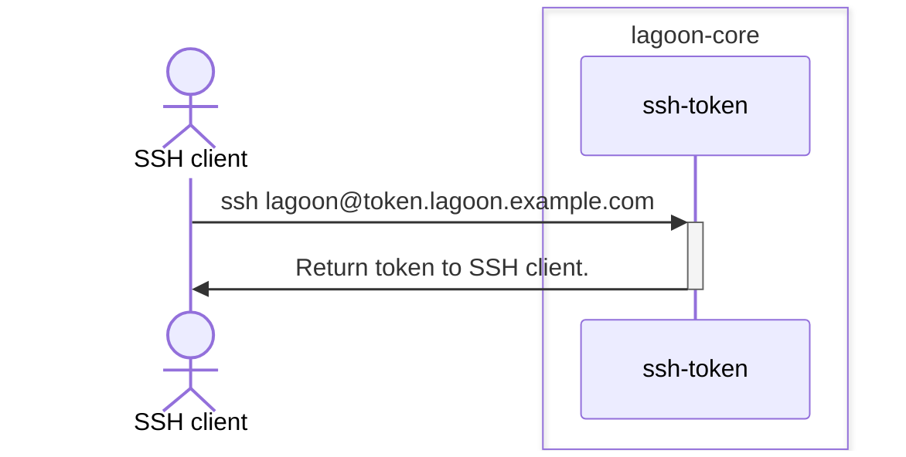

# Lagoon SSH services

[](https://pkg.go.dev/github.com/uselagoon/lagoon-ssh-portal)
[](https://github.com/uselagoon/lagoon-ssh-portal/actions/workflows/release.yaml)
[](https://github.com/uselagoon/lagoon-ssh-portal/actions/workflows/coverage.yaml)
[](https://goreportcard.com/report/github.com/uselagoon/lagoon-ssh-portal)
[](https://securityscorecards.dev/viewer/?uri=github.com/uselagoon/lagoon-ssh-portal)
[](https://www.bestpractices.dev/projects/8299)

This repository contains three related SSH services for [Lagoon](https://github.com/uselagoon/lagoon).

## SSH Portal

`ssh-portal` is a cluster-local SSH service which enables SSH access to running workloads in a Lagoon Remote.
To perform authentication it communicates back to `ssh-portal-api` running in Lagoon Core, which responds with a true/false if the SSH key is valid for the requested Lagoon environment.

`ssh-portal` implements shell access with service and container selection [as described in the Lagoon documentation](https://docs.lagoon.sh/using-lagoon-advanced/ssh/#ssh-into-a-pod), but it does not implement token generation.
Unlike the existing Lagoon SSH service, `ssh-portal` _only_ provides access to Lagoon environments running in the local cluster.

`ssh-portal` also implements container, build, and task logs access via SSH.
Users can retrieve logs by giving a `logs=tailLines=n,follow` argument to the ssh command, where `n` is a non-negative integer and `,follow` is optional.
The logs API should not be considered stable and should be accessed through the [Lagoon CLI](https://github.com/uselagoon/lagoon-cli).
This feature is disabled by default; see Usage below to enable it.

### Usage

This service is part of Lagoon and is designed to be used in the [Lagoon Remote chart](https://github.com/uselagoon/lagoon-charts/tree/main/charts/lagoon-remote).
For an overview of options, run `ssh-portal --help` or `ssh-portal serve --help`.

## SSH Portal API

`ssh-portal-api` is part of Lagoon Core, and serves authentication and authorization queries from `ssh-portal` services running in a Lagoon Remote.

`ssh-portal-api` is explicitly _not_ a public API and makes no guarantees about compatibility.
It is _only_ designed to cater to the requirements of `ssh-portal`.

### Usage

This service is part of Lagoon and is designed to be used in the [Lagoon Core chart](https://github.com/uselagoon/lagoon-charts/tree/main/charts/lagoon-core).
For an overview of options, run `ssh-portal-api --help` or `ssh-portal-api serve --help`.

## SSH Token

`ssh-token` is part of Lagoon Core, and it serves JWT token generation requests.

This service does not provide shell access.
Instead, it authenticates users by SSH key and returns a user access token which can then be used to authenticate to the Lagoon API.

The API is:

| Command                       | Output                                                                                                |
| ---                           | ---                                                                                                   |
| `ssh lagoon@$TOKEN_URL token` | Bare OAuth2 `access_token`.                                                                           |
| `ssh lagoon@$TOKEN_URL grant` | Full OAuth2 token JSON object containing `access_token`, `expiry`, `refresh_token`, and `token_type`. |

This API is not intended for end users to access directly.
Instead you should use the [Lagoon CLI](https://uselagoon.github.io/lagoon-cli/commands/lagoon_get_token/) to obtain a token if you really need one.

### Usage

This service is part of Lagoon and is designed to be used in the [Lagoon Core chart](https://github.com/uselagoon/lagoon-charts/tree/main/charts/lagoon-core).
For an overview of options, run `ssh-token --help` or `ssh-token serve --help`.

## High-level Architecture

This diagram shows the architecture of the Lagoon SSH services.
It depicts two Lagoon Remote clusters, each with an `ssh-portal` installed, and a controlling Lagoon Core cluster with the `ssh-portal-api` installed.

Some important features (which differ from the legacy Lagoon SSH service):

* There are multiple SSH endpoints.
  Each Kubernetes Cluster running Lagoon environments (i.e. `lagoon-remote` cluster) has its own `ssh-portal`.
* In order to SSH to a Lagoon environment, the user has to initiate a connection to the `ssh-portal` running in the same `lagoon-remote` cluster.
* In order to retrieve a Lagoon API token, the user has to connect to the `ssh-token` endpoint in the `lagoon-core` cluster.
* Inter-process communication between Lagoon SSH components is handled by [NATS](https://nats.io/).
  A single NATS cluster is formed between NATS nodes running in remote and core Kubernetes clusters.
* Communication between NATS leaf nodes in remote clusters and NATS in the core cluster is protected via mutual TLS.



### SSH Portal sequence diagram

This diagram shows the sequence of a successful SSH shell connection to a Lagoon service in a Kubernetes cluster.



### SSH Token sequence diagram

This diagram shows the sequence of a successful SSH token request.



## Troubleshooting SSH connections

If you are running into issues with SSH in Lagoon, the first thing to check is if the user is connecting to the correct SSH endpoint:

* If they want to execute a command or get an interactive shell, they need to connect to the `ssh-portal` endpoint of the cluster their Lagoon environment is running in.
  This information can be retrieved from the Lagoon API.
* If they want to get a Lagoon API token, they need to connect to the single `ssh-token` endpoint.
  This endpoint does not provide any shell access; it only provisions API tokens.

The [Lagoon CLI](https://github.com/uselagoon/lagoon-cli)'s `ssh` command will take care of all this transparently, and is highly recommended.

If a user gets an error from a Lagoon SSH service it may not contain much detail for security reasons.
However, errors returned to the user will contain a unique Session ID (SID).
This SID is also logged to the standard error of the SSH service along with any errors, so it will appear in the container logs along with more detail about exactly what went wrong.
This helps to correlate error messages reported by users with detailed errors in service logs visible only to administrators.

## Development tips

### Build locally

The build process requires [goreleaser](https://github.com/goreleaser/goreleaser) 2.x to be installed in your path.

`make build` will build a binary for your local architecture in `dist/`.

`make release-snapshot` will build binaries and docker images for all configured architectures.

### Build manually

Regular `go build` / `docker build` also works with the right incantations:

```bash
# example manual build command for ssh-portal binary/image
# adjust as required for other binaries/architectures
CGO_ENABLED=0 GOOS=linux GOARCH=amd64 go build -o dist/ssh-portal ./cmd/ssh-portal
docker build --build-arg=BINARY=dist/ssh-portal -t foo/ssh-portal:v99 --platform=linux/amd64 .
```

### Running tests

`make test` will run the test suite.
It regenerates code, so requires [mockgen](https://github.com/uber-go/mock/) and [enumer](https://github.com/dmarkham/enumer/) to be installed in your path.

Alternatively you can just run `go test -v ./...` manually to avoid regenerating any code.

### Debugging Keycloak permissions

A command to debug Keycloak permissions locally is included in `./cmd/keycloak-debug`.
This command uses the same Keycloak client and permissions code as the `ssh-portal-api`.
Run it to dump the Keycloak `group-name:group-id` map, and easily reproduce any errors.

```bash
export KEYCLOAK_BASE_URL=http://lagoon-keycloak.example.com/ KEYCLOAK_SERVICE_API_CLIENT_SECRET=abc-123
go run ./cmd/keycloak-debug
```
